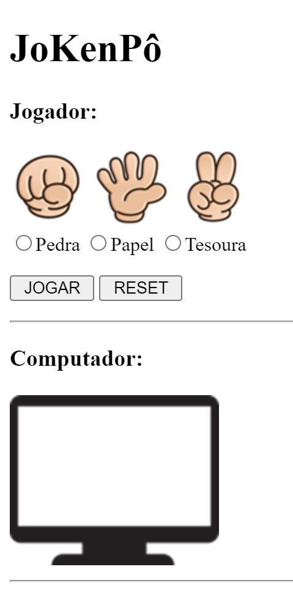
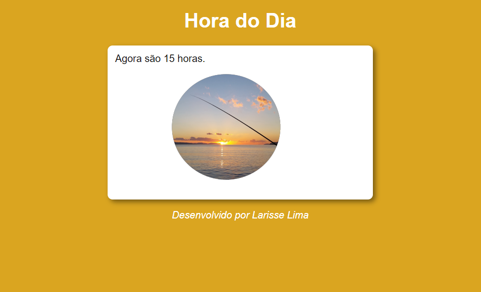
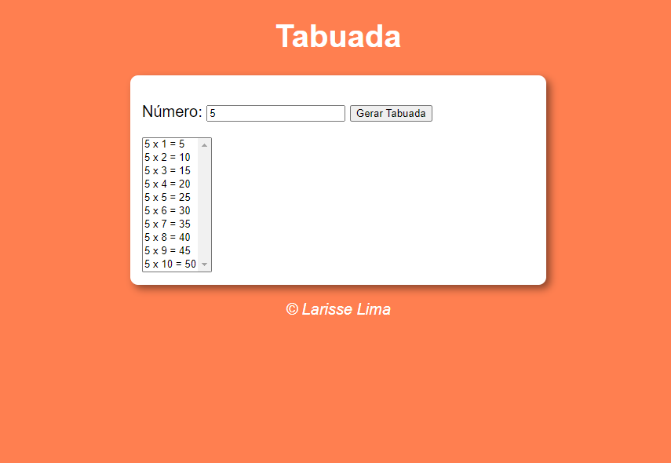
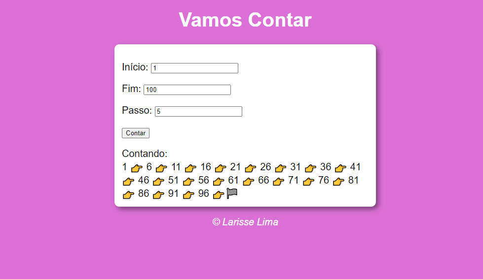

# exercios-js

<h2 align="center">Execícios práticos com JavaScript</h2>

 Jogo Jokenpô feito com Javascript.O famoso jogo feito para jogar com o computador.

 Verificador de Idade feito com Javascript. Verifica a idade e gênero das pessoas.

 Hora do Dia feito com Javascript, muda o bakground conforme a hora do dia.

 Tabuada simples,com JavaScript.

 Contador de números,usando estruturas de repetição em Javascript.

[ LinkedIn ](https://www.linkedin.com/in/larisselima/)

<h3 align="center">Desenvolvido por Larisse Lima :coffee: </h3>
